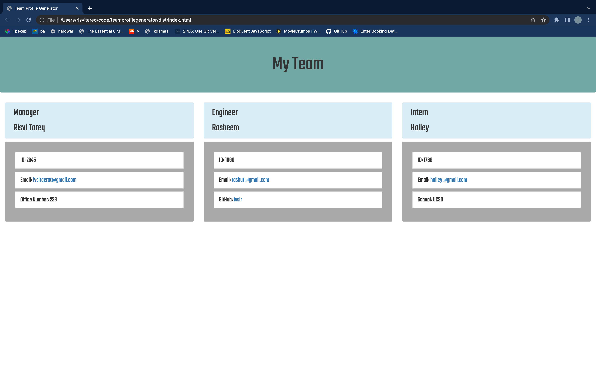

# Team Profile Generator

## Description
The application generates a webpage containing information about a company's team. It prompts users to input information regarding a single team manager and different engineers or interns who are part of the team. Each position is assigned to a card on the webpage that contains the position name, the name of the employee, their email and ID number.

## Table of Contents
<nav>
    <ol>
        <li><a href="#Installation">How to Use this Project</a></li>
        <li><a href="#Usage">Usage</a></li>
        <li><a href="#Credits">Credits</a></li>
        <li><a href="#Questions">Questions</a></li>
    </ol>
</nav>

## Usage

## Credits
Risvi Tareq

## Questions
<li>https://github.com/ivsir </li>
<li>Email: ivsirqerat@gmail.com</li>

